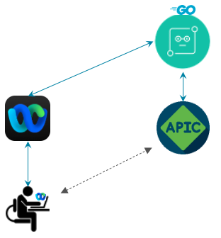
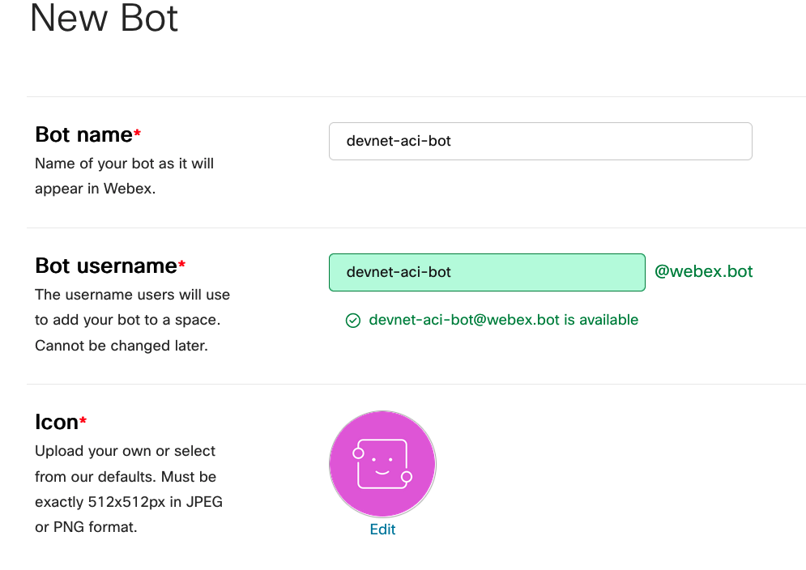
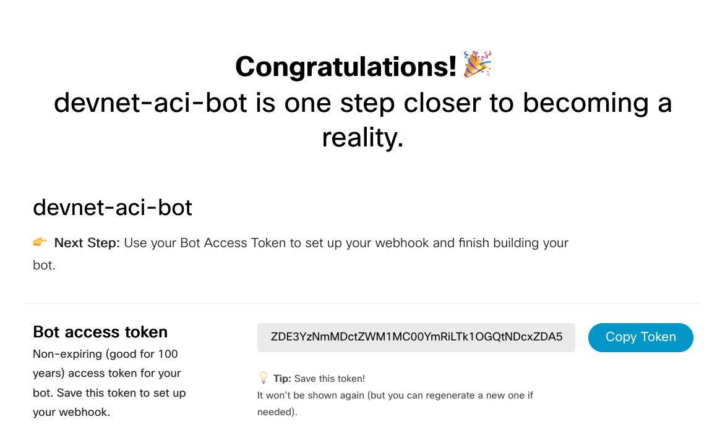
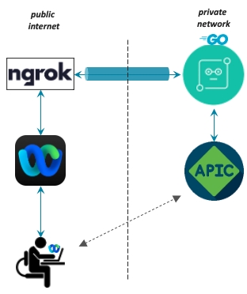
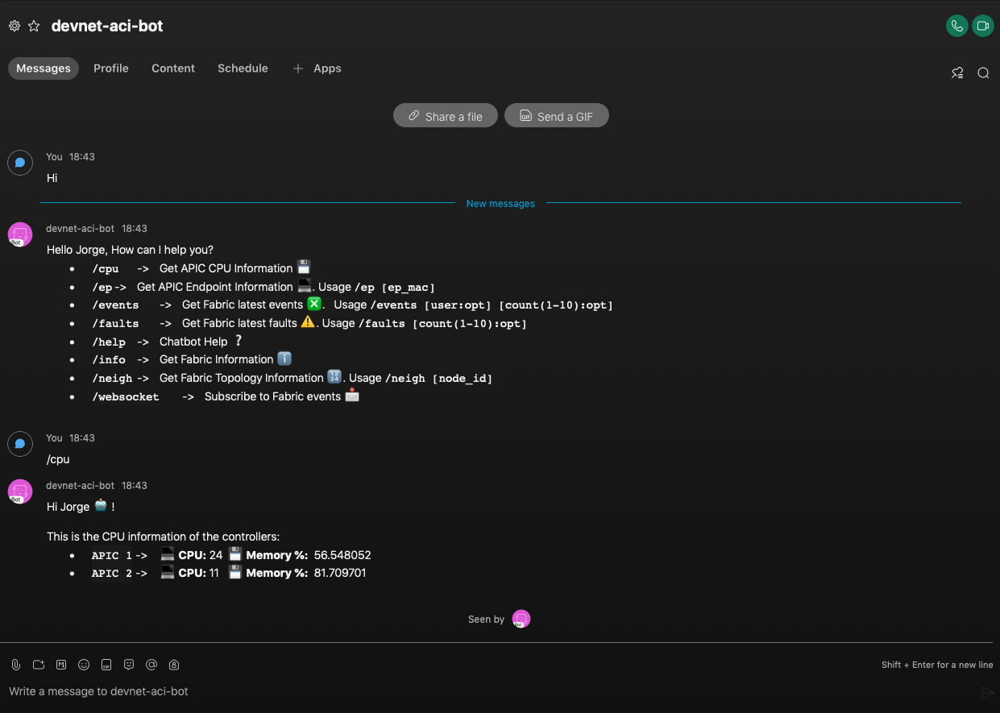

# Monitor an ACI Fabric from your favorite Webex Room - ChatOps

A lightweight bot application to interact with the APIC from a Webex Chat room

## Use Case description

Monitor your Data Center using an user-friendly bot. This repository contains a [Go](https://go.dev/)-based application that spins up a web server, which listens to [Webex](https://www.webex.com/) webhooks events an interacts with the [APIC](https://www.cisco.com/c/en/us/products/cloud-systems-management/application-policy-infrastructure-controller-apic/index.html) REST API to retrieve information about the operational status of your Fabric.

<p align="center">

<br/>

This is the list of supported commands.

```
•	/cpu	->	Get APIC CPU Information 💾
•	/ep	->	Get APIC Endpoint Information 💻. Usage /ep [ep_mac] 
•	/events	->	Get Fabric latest events ❎.   Usage /events [user:opt] [count(1-10):opt] 
•	/faults	->	Get Fabric latest faults ⚠️. Usage /faults [count(1-10):opt] 
•	/help	->	Chatbot Help ❔
•	/info	->	Get Fabric Information ℹ️
•	/neigh	->	Get Fabric Topology Information 🔢. Usage /neigh [node_id] 
•	/websocket	->	Subscribe to Fabric events 📩
```

Even though most of the commands 

## Prerequisites

* Make sure to have Go 1.15+ or Docker installed on your computer/server

    * [Install Go](https://go.dev/doc/install)
    * [Install Docker](https://docs.docker.com/get-docker/)

* Login to your Webex account and create your own bot. [Create Bot](https://developer.webex.com/docs/bots)

    1. Give your bot details

        
    
    2. Copy the generated bot token, it will be required later

        

## Installation

### Execute ngrok (Optional)

The bot application must be hosted in a server reachable via the public internet, as the webhooks are delivered from webex.com. For development and testing pursposes you could use [ngrok](https://ngrok.com/) to expose your server to the public internet. Ngrok will expose your application (Server IP & Port) over a secure tunnel.

<p align="center">

<br/>

* [Install ngrok](https://ngrok.com/download)

Follow these instruction after installing ngrok:

* Start the ngrok service stating the port the bot server listens to. By default is listens to por **7001**, however if you are using the docker container you shoudl list the port used for port-forwarding.

        ./ngrok http <bot_pot> --region=eu

```
ngrok by @inconshreveable    

Session Status                online
Session Expires               1 hour, 59 minutes
Version                       2.3.40
Region                        Europe (eu)
Web Interface                 http://127.0.0.1:7001
Forwarding                    http://2d6e-89-246-96-47.eu.ngrok.io -> http://localhost:7001
Forwarding                    https://2d6e-89-246-96-47.eu.ngrok.io -> http://localhost:7001

Connections                   ttl     opn     rt1     rt5     p50     p90
                              0       0       0.00    0.00    0.00    0.00
```

*  The generated HTTP url is your `BOT_URL`

> **_NOTE:_**:  The trial version of ngrok creates the secure tunnel only for 2 hours

### Option 1: Build the code from source

* Set and source the environmental variables in `env.sh`

```
export WEBEX_TOKEN=YOUR-WEBEX-TOKEN-GOES-HERE
export BOT_URL=http://c314-173-38-220-48.eu.ngrok.io
export APIC_URL=https://sandboxapicdc.cisco.com/
export APIC_USERNAME=admin
export APIC_PASSWORD=admin
```
        source env.sh

* Execute the application

        go run main.go

### Option 2: Execute the service as a Container

* Set the environmental variables in `.env`:

```
WEBEX_TOKEN=herehoesyourbotwebextoken
BOT_URL=http://2258-173-38-220-34.eu.ngrok.io
APIC_URL=https://sandboxapicdc.cisco.com/
APIC_USERNAME=admin
APIC_PASSWORD=admin
```

*  Run the application in a Docker container

            docker run --env-file .env -it -p 8080:7001 jgomezve/aci-chatbot:latest

> **_NOTE:_** Be careful with the port forwarding when using ngrok. The web server listens to the port 7001

## Usage

Either send a message directly to your bot or add it to a Webex Group



> **_NOTE:_** Some commands do not work if the target APIC is a simulator